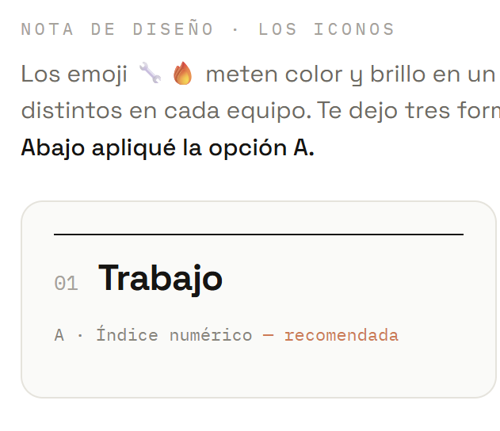

Fuinos nace con la idea de ser la herramienta de colaboracion Nro1 en la industria del mueble cubriendo el recorrido Fabrica -> Distribuidor -> Tienda -> Consumidor

<!--
  Para insertar una imagen optimizada:
  1. Guarda el archivo en src/assets/projects/  (ej. fuinos-dashboard.png)
  2. Descomenta la línea de abajo y ajusta el nombre.
  La ruta es relativa a este .md → ../../../assets/ apunta a src/assets/

-->

[Visita FuinOS!](https://app.fuinos.com/auth/login)